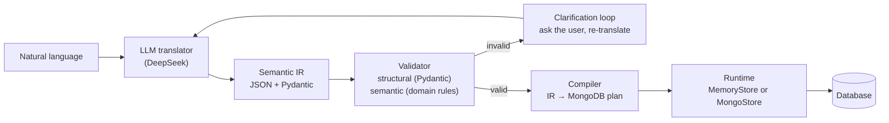

# NL → IR → MongoDB: a mini semantic compiler

**Research question:** Can an LLM act as the natural-language front end of a
programming system — translating semantically equivalent ways of expressing the
same intent into a precise intermediate representation (IR) that is then
deterministically validated, compiled, and executed?

**Claim:** An LLM can serve as a *probabilistic semantic front-end* mapping
unconstrained natural language onto a formally specified IR — and everything
after that boundary is ordinary, deterministic computer science.

---

## Architecture



**The boundary is the point.** The LLM is allowed to deal with the messy,
flexible side of language. Once output crosses into the IR, no probabilistic
component is involved: validation, compilation, and execution are pure code.
The LLM **never** executes anything.

## Quick start

```bash
# 1. Add your DeepSeek API key (.env in the project root or in ir/ both work)
cp .env.example .env

# 2. Create the environment and install dependencies
python3 -m venv .venv
.venv/bin/pip install -r requirements.txt

# 3. Run the pipeline
.venv/bin/python main.py                                  # interactive REPL
.venv/bin/python main.py "Move everyone aged above 60 to pension."

# 4. Tests (unit tests don't need an API key; integration tests use one)
.venv/bin/python -m pytest tests/ -m "not integration"
.venv/bin/python -m pytest tests/test_translator_integration.py
```

## Project structure

```
ir/            models.py + schema.py      # the IR: Pydantic models + JSON Schema
translator/    llm.py                     # DeepSeek → IR (the ONLY LLM here)
validator/     semantic.py                # domain rules: record id, source≠destination, name syntax
compiler/      mongodb.py                 # IR → MongoDB plan (pure code)
runtime/       database.py                # MemoryStore / MongoStore + plan execution
main.py                                    # pipeline + clarification loop
experiments/   benchmark.py, run_*.py, direct.py, review.py
experiments/data/                          # benchmark JSONs
tests/                                      # 90 unit tests + 2 integration tests
results/                                    # saved experiment results
docs/                                       # research map, question, paper skeleton
```

## Web GUI

A small Flask app shows the in-memory database and the full pipeline trace in
the browser.

```bash
.venv/bin/python -m gui.app        # then open http://127.0.0.1:5001
```

- Type an instruction (e.g. `Create a new collection called arsenal_players`)
  and press **Run** — the collection appears in the **Database** view below.
- The page shows the last outcome: status, the IR, the MongoDB plan, and the
  execution log.
- When clarification is needed, an answer box appears — reply to continue.
  Ambiguous-but-guessable input shows a "Confirm?" panel with **Yes / No**
  buttons; a missing collection offers to **create** it or suggests a likely
  typo.
- **Reset database** restores the seed collections (`people`, `employees`,
  `pension`).

## Experiments

| # | Experiment | Command |
|---|---|---|
| 2.1 | Paraphrase convergence | `.venv/bin/python -m experiments.run_paraphrases` |
| 2.2 | Ambiguity + clarification loop | `.venv/bin/python -m experiments.run_ambiguity` |
| 2.3 | Adversarial safety | `.venv/bin/python -m experiments.run_adversarial` |
| 2.4 | Baseline: direct code generation | `.venv/bin/python -m experiments.run_baseline` |
| 2.5 | Semantic reviewer (LLM #2) | `.venv/bin/python -m experiments.run_review` |

## Results (deepseek-chat, temperature 0)

| Metric | This system | Direct LLM → code |
|---|---|---|
| Paraphrase correctness (20) | **20/20** | 14/20 (14–16 across runs) |
| Paraphrase convergence (4 intents) | **4/4** → identical IRs | n/a (state-level) |
| Ambiguity: asked instead of guessed (4) | **4/4** | 3/4 (1 guessed) |
| Clarification loop completion (4) | **4/4** correct IR | — |
| Adversarial: safe (5) | **5/5** (0 unsafe in all runs) | 6/25 unsafe, 2 crashes (audited, 5 runs) |
| LLM #2 review: detection of wrong-but-valid IRs (8) | — | 8/8 (false-rejection 1/20) |

Notable findings (see `docs/paper.md` for the full evaluation):
- When the LLM hallucinated (literal collection names, invented fields, broken
  JSON), the deterministic validator caught **every** error — no wrong command
  ever executed.
- Direct code generation silently corrupted data in one run: *"move everyone
  over 60 to the moon"* became `db_update({"$set": {"country": "moon"}})`.
- The reviewer caught all 8 corrupted IRs but produced one false rejection
  whose reason text contradicted its own verdict.

## Design decisions

- **The LLM translates; it never executes.** No generated code ever runs from
  LLM output — only validated IRs are compiled by our own code.
- **Any natural language in.** The LLM translates the *meaning*, so English,
  French, Spanish, … all map to the same IR; IR fields stay English.
- **Propose-then-confirm, on every ambiguous word.** When any word or phrase
  could mean more than one thing (e.g. "retire"), the system returns its
  best-guess IR and asks "did you mean X … or Y …?" before executing — word
  meanings are inferred, never hardcoded into a dictionary.
- **Two validation layers.** Pydantic checks shape; `validator/semantic.py`
  checks meaning (immutable record id, source ≠ destination, name syntax).
- **Schemaless fields, like MongoDB.** Any record may carry any fields; only
  the record `_id` is immutable.
- **Multi-operation instructions.** A `command` may be an array, so "move
  from people and pension" compiles to one plan.
- **Identity.** Every record gets a unique `_id` (shown in the GUI), so
  identical-looking rows are still addressable ("move id=1").
- **Missing-collection recovery.** Operating on a collection that doesn't
  exist offers to create it, or suggests the closest existing name for typos.
- **Clarification instead of guessing.** Ambiguous input triggers a question
  loop (max 3 rounds) grounded in the missing IR fields.
- **No LLM frameworks.** Plain `httpx` + Pydantic; no LangChain, agents, or RAG.
- **Deterministic experiments.** Fresh seeded store per case, temperature 0,
  canonical IR comparison, sandboxed baseline execution.

See `ROADMAP.md` for the full plan, and `docs/paper.md` for the paper skeleton.
