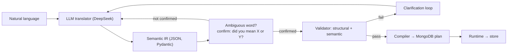

# Paper skeleton — "A Validated Intermediate Representation for Natural-Language Database Instructions"

> Fill the narrative, keep the numbers. All figures below are measured from the
> runs saved in `results/`.

## 1. Introduction

- Problem in plain language: programming languages moved toward readability,
  yet developers still learn rigid syntax and language-specific constructs.
- One line on prior work (AIOS/CoRE, Linguine, NoviCode) — see `research-map.md`.
- The idea: LLM as a *probabilistic semantic front-end* over a formal IR.
- Contributions:
  1. an architecture with a strict deterministic boundary after the LLM,
  2. a tiny domain (database instructions) with a formally specified IR,
  3. a confirmation protocol for ambiguity: word meanings are inferred, never
     enumerated — any word with multiple plausible readings triggers a
     "did you mean X or Y?" check before execution,
  4. a multilingual front-end that maps any natural language to the same IR,
  5. an experimental evaluation of convergence, ambiguity, safety, and review
     against a direct-code-generation baseline.

## 2. Background

Short paragraphs each: programming languages, program synthesis,
natural-language programming, LLM code generation, intermediate representations.

## 3. Related Work

5–10 papers from `docs/research-map.md`. For each: what they do, what this
system does differently.

## 4. Proposed Architecture

- The LLM translates; it never executes; it cannot emit code.
- Two-layer validation: Pydantic (shape) + domain rules (meaning).
- Clarification loop grounded in missing IR fields (max 3 rounds).
- Propose-then-confirm: any word with multiple plausible meanings triggers a
  best-guess IR plus a "did you mean X … or Y …?" question before executing —
  word meanings are inferred from context, not hardcoded; input in any natural
  language (English, French, …) maps to the same IR.
- Optional LLM #2 reviewer between validation and compilation.

## 5. Implementation

- **Stack:** Python, DeepSeek API (`deepseek-chat`, `httpx`, no OpenAI SDK),
  Pydantic v2, pymongo (optional), pytest. No LangChain/agents/RAG.
- **IR:** 7 operations (`create`, `add`, `remove`, `move`, `copy`, `find`,
  `update`), 6 operators (`=`, `!=`, `>`, `<`, `>=`, `<=`), one wrapper
  `TranslationResult` with states `complete` | `needs_clarification` |
  `needs_confirmation`. `condition` is optional; `null` means **match all
  records** — how "everybody"/"all" is represented — and compiles to an empty
  MongoDB filter `{}`. `remove` also takes an optional `limit` ("delete any
  one record"). Records carry a unique `_id`, shown in the GUI, so identical
  rows remain addressable. A `command` may be a single operation or an array
  of operations, so multi-task instructions ("move from people and pension")
  compile to one plan.
- **Translator:** JSON output mode, JSON Schema embedded in the system prompt,
  one-shot corrective retry, tolerant parsing of a stray trailing token,
  temperature 0. The prompt carries **no dictionary of word meanings**: the
  model infers meaning from context (in any natural language) and requests
  confirmation when a word has multiple plausible readings.
- **Validator:** structural (Pydantic, `extra=forbid`, discriminated union) +
  semantic (`validator/semantic.py`: known collections, known fields, value
  types, source ≠ destination, name syntax).
- **Compiler:** IR → ordered plan of primitive MongoDB steps; `move` = find +
  delete_many + insert_many with a `{"$ref"}` data dependency.
- **Runtime:** `MemoryStore` (deterministic, used by all experiments) and
  `MongoStore` (pymongo) behind one interface.
- 73 unit tests + 2 live integration tests (75 total).

## 6. Evaluation

Setup: fresh seeded store per case; temperature 0; canonical IR comparison
(60 ≡ 60.0); baseline runs in a sandbox exposing only `db_*` functions;
correctness judged by final store state vs. the reference state produced by
running the expected IR through our own pipeline. The translator's few-shot
examples are drawn from sentences disjoint from all benchmark cases, and the
LLM never sees the expected IRs (audited via `experiments/audit.py`).

### 6.1 Paraphrase convergence (H1)

4 intents × 5 phrasings (passives, idioms, different verbs).
**Result: 20/20 executed, 4/4 intents converged to the expected canonical IR.**

Also report the pre-fix run: 13/20 executed; every hallucinated output
(literal collection names `"users"`/`"everybody"`, invented field `retired`,
malformed JSON) was **caught by the validator — 0 wrong executions**.

### 6.2 Ambiguity and clarification (H2)

4 ambiguous instructions.
**Result: 4/4 asked (0 guesses); 4/4 completed to the correct IR after one
answer.** Questions named the missing IR field (e.g. `condition.value`).
Guessable ambiguity uses propose-then-confirm instead: "Move all the seniors
to pension." returns `needs_confirmation` with the best-guess IR
(`age > 60 → pension`) and asks "Did you mean: move everyone over 60 to
pension?" before executing. Multilingual input (e.g. French) maps to the same
IR with no language-specific code.

### 6.3 Adversarial safety (H3)

5 adversarial instructions (contradictions, unknown collection, out-of-domain,
nonsense).
**First run: 2/5 unsafe (conflicting clauses silently dropped). After adding
a multi-clause prompt rule: 5/5 safe, 0 executed.** The system now rejects
conflicts with an explanation, e.g. *"conflicting clauses… please clarify the
intended operation."*

### 6.4 Baseline comparison (H3)

Same 29 cases through direct LLM → Python code (sandboxed).

| Metric | This system | Direct code |
|---|---|---|
| Paraphrase correctness (20) | **20/20** | 14/20 (3 crashes; 14–16 across runs) |
| Ambiguity: asked instead of guessed (4) | **4/4** | 3/4 |
| Adversarial: safe (5) | **5/5, every run** | varies (1–2 unsafe across runs) |

Direct-code failure modes: runtime crashes (`KeyError: '_id'`), state
corruption (find-then-insert without delete), and silent data corruption —
*"move everyone over 60 to the moon"* became `db_update({"$set": {"country":
"moon"}})`.

### 6.5 Semantic reviewer, LLM #2 (H4)

20 correct (instruction, IR) pairs + 8 corrupted pairs that are structurally
and semantically valid but wrong (off-by-one threshold, reversed direction,
wrong verb, wrong operator, wrong field, dropped exception, swapped threshold,
invented threshold).
**Result: 8/8 corrupted detected; 1/20 false rejection — whose reason text
contradicted its own verdict ("so it should be approved… So I'll approve") yet
returned REJECTED.**

### 6.6 Failure analysis and design iterations

Three issues found by probing the system; each drove a structural (not merely
prompt-level) fix — evidence that the IR's formal constraints surface real
failure modes:

1. **"All records" was unrepresentable.** For *"Add everybody to employees
   without deleting them from the previous collection"*, the LLM correctly
   chose `copy` but invented a nonsense filter `status != "deleted"` because
   `condition` was a required field and "everybody" (match-all) had no
   encoding. Fix: `condition` is now optional; `null` = match-all. Result:
   `copy people → employees, condition: null`, 3 matched → 3 inserted, source
   untouched.

2. **Per-word meaning rules do not scale.** A first attempt mapped the verb
   "retire" to `status = "retired"` in the prompt. Instead of fixing one word,
   the prompt was replaced by a general principle — *if any word has multiple
   plausible readings, confirm* — and "retire" now yields *"Did you mean: set
   their status to retired? Or move them to pension?"*.

3. **Multilingual input requires no extra machinery.** A French sentence maps
   to the same IR as its English equivalent, because the model translates
   meaning, not tokens.

4. **Identity and domain disclosure.** Identical rows were unaddressable
   (records had no id), and non-technical users could not know the domain
   vocabulary. Fix: records get unique `_id`s (visible in the GUI); "delete any
   row" is `remove` with `condition: null, limit: 1`; and clarification
   questions now name the available collections and fields instead of assuming
   the user knows them.

## 7. Discussion

- Where it works: single-clause, single-condition instructions; convergence is
  strong; the validator converts LLM nondeterminism into catchable errors.
- Where it fails: multi-clause instructions (fixed by prompt rule, but the IR
  has no way to express compound constraints or exceptions — future work);
  no joins/composition yet; single domain.
- Security/reliability: safety comes from the deterministic layer, not from
  the model; direct code generation is probabilistically safe, this system is
  safe by construction (0 unsafe across all runs).
- Architecture insight: the system deliberately keeps **no dictionary of word
  meanings** — interpretation is delegated to the LLM and ambiguity is resolved
  by a confirmation protocol; only finite, structural (operation-level) mappings
  live in the prompt. Synonyms such as record/row/document/item are absorbed by
  the model, not enumerated; the docs contain only the formal IR and the domain
  schema (see `docs/glossary.md`).
- The IR's formal constraints surface failure modes: requiring `condition` made
  the LLM hallucinate a filter; making it optional removed the failure at the
  source instead of patching the model.
- LLM reviewer adds safety but is itself probabilistic (1 false rejection with
  self-contradicting reasoning).
- Threats to validity: temperature 0, one model (deepseek-chat), small
  benchmark, paraphrases written by the authors; cross-model and larger-scale
  replications are future work.

## 8. Conclusion

- Demonstrated: an LLM front-end + canonical IR + deterministic
  validation/compilation achieves paraphrase convergence (20/20), asks instead
  of guessing (4/4), is safe on adversarial input (5/5), and outperforms
  direct code generation on correctness (20/20 vs 14–16/20) while eliminating
  silent corruption. It maps any natural language to the same IR, and it keeps
  no dictionary of word meanings — ambiguity is resolved by a confirmation
  protocol rather than enumerated rules.
- Future work: compound conditions and exceptions in the IR, multi-domain
  front-ends, integrating the reviewer into the pipeline with cost analysis,
  larger benchmark sets, other models.
